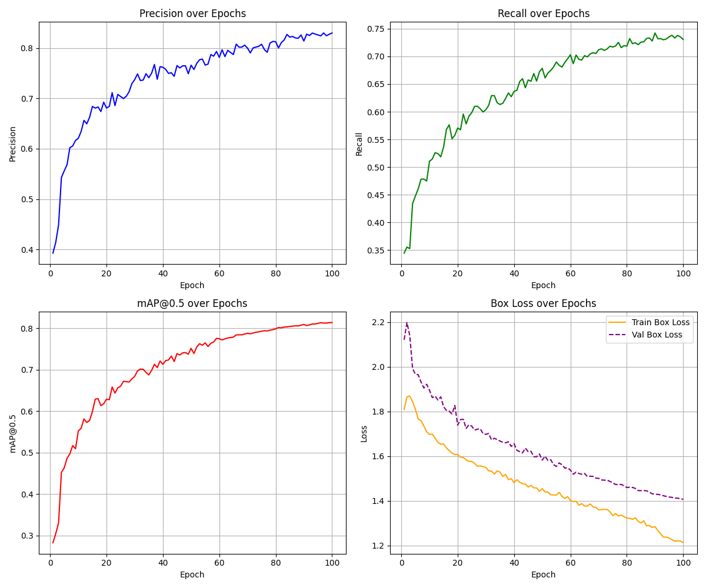

# Semester 4 Project — RoadWatch (Django dashboard + pothole detector)

This repo has three pieces that work together:

1. **Django web app** (`djngo/`)
   - Dashboard at `/` showing clustered pothole locations on a Leaflet map.
   - JSON API endpoints used by the dashboard and the detector.
2. **Windows location service** (`loc.py`)
   - A small Flask server that exposes `GET /location` using the native Windows Geolocation API.
3. **Pothole detector/uploader** (`phoneCode/ai.py`)
   - Runs YOLO inference on a webcam or IP camera stream.
   - When a pothole is detected, it asks the location service for GPS and stores `[lat, lon]` points.
   - Press **Enter** to upload the collected points to the Django API and quit.

---

## Quickstart (Windows PowerShell)

### 0) Create a virtual environment

From the repo root:

```powershell
Set-Location "c:\Users\aksha\Desktop\DTIproj\semester-4-project"
python -m venv .venv
# If activation is blocked:
Set-ExecutionPolicy -Scope Process -ExecutionPolicy Bypass
.\.venv\Scripts\Activate.ps1
python -m pip install --upgrade pip
```

> Note: The detector stack (Torch/Ultralytics/OpenCV) can be large. If you prefer, create a separate environment for `phoneCode/`.

### 1) Install backend (Django) + location service deps

```powershell
python -m pip install "Django>=6,<7" flask requests winsdk
```

### 2) Start Django (dashboard + API)

```powershell
python .\djngo\manage.py migrate
python .\djngo\manage.py runserver 127.0.0.1:8000
```

Open:
- Dashboard: http://127.0.0.1:8000/
- Admin: http://127.0.0.1:8000/admin/

Create an admin user (optional):

```powershell
python .\djngo\manage.py createsuperuser
```

### 3) Start the Windows location API (Flask)

In a **new** terminal (repo root, venv activated):

```powershell
python .\loc.py
```

This serves:
- `GET http://127.0.0.1:5000/location`

Requirements:
- Windows **Location Services must be enabled**.
- First run may trigger a permission prompt.

### 4) Run the pothole detector and upload points

Install detector requirements:

```powershell
python -m pip install -r .\phoneCode\requirements.txt
```

Run (uses CPU; uses local webcam if you set `--stream-url ""`):

```powershell
python .\phoneCode\ai.py --device cpu --stream-url "" --location-url "http://127.0.0.1:5000/location" --api-url "http://127.0.0.1:8000/api/clusters/"
```

How it behaves:
- Captures a frame every ~3 seconds.
- Prints `YES` when a pothole hit occurs (confidence >= `--min-hit-conf`, default `0.70`).
- On `YES`, saves an annotated image into `phoneCode/pothole_predictions/` and appends `[lat, lon]` (if location API succeeds).
- Press **Enter** to upload the collected locations to Django and quit.

---

## What the dashboard does

The dashboard is rendered by `siteapp` (`djngo/siteapp/`). It:
- Loads clusters computed on the server from saved `LocationPoint` rows.
- Lets you search locations (Nominatim) via `/api/geocode/?q=...`.
- Lets you toggle **Satellite** imagery.
- When you click a cluster marker, it requests nearby road geometries from `/api/roads/` and draws a 500m “orange glow” overlay.
- The cluster list has a **Delete** button that calls `/api/clusters/delete/`.

---

## API reference (Django)

Base URL (dev): `http://127.0.0.1:8000`

### `POST /api/clusters/`
Stores points and returns clusters.

Body:

```json
{ "locations": [[28.45, 77.58], [28.451, 77.585]] }
```

Response:

```json
{ "clusters": [{"lat": 28.45, "lng": 77.58, "count": 2, "point_ids": [1,2]}], "points_saved": 2 }
```

### `POST /api/clusters/delete/`
Deletes a cluster by deleting all `LocationPoint` ids in `point_ids`.

Body:

```json
{ "point_ids": [1,2,3] }
```

### `GET /api/geocode/?q=...`
Searches Nominatim (OpenStreetMap) and returns the first hit.

### `GET /api/roads/?lat=...&lng=...&r=...`
Uses Overpass to return nearby road polylines (used for the orange glow overlay).
- `r` is radius in meters (defaults to 500, clamped to 50..2000)

---

## Useful project commands

### Run Django tests

```powershell
python .\djngo\manage.py test
```

### Reset the SQLite database (dev)

This deletes all stored points (and admin user accounts).

```powershell
Remove-Item .\djngo\db.sqlite3 -ErrorAction SilentlyContinue
python .\djngo\manage.py migrate
```

### Seed sample points

`djngo/rough.py` posts a sample payload into `/api/clusters/`.

```powershell
python -m pip install requests
python .\djngo\rough.py
```

---

## Common issues

- **`ModuleNotFoundError: No module named 'django'`**
  - Install it: `python -m pip install "Django>=6,<7"`.

- **`loc.py` returns 500 / latitude=0**
  - Enable Windows Location Services and allow permission for Python.
  - Make sure `winsdk` is installed: `python -m pip install winsdk`.

- **Detector uses an unexpected IP camera stream by default**
  - `phoneCode/ai.py` defaults `--stream-url` to a non-empty value. To force webcam: pass `--stream-url ""`.

- **Detector can’t reach the location API**
  - Override the default: `--location-url "http://127.0.0.1:5000/location"`.

- **Overpass/Nominatim rate limits**
  - The dashboard calls public OSM services. If they’re slow/unavailable you may see search/roads failures.

---

## Repo layout

- `djngo/` — Django project (`mysite`) + app (`siteapp`) + SQLite DB
- `loc.py` — Flask location service (`/location`) for Windows
- `phoneCode/` — YOLO pothole detector + uploader, model weights (`best.pt`)

## Model Performance Metrics

The embedded validation metrics from the YOLO model checkpoint are:
- **Precision:** 83.0%
- **Recall:** 73.1%
- **mAP@50:** 81.4%
- **mAP@50-95:** 50.9%



